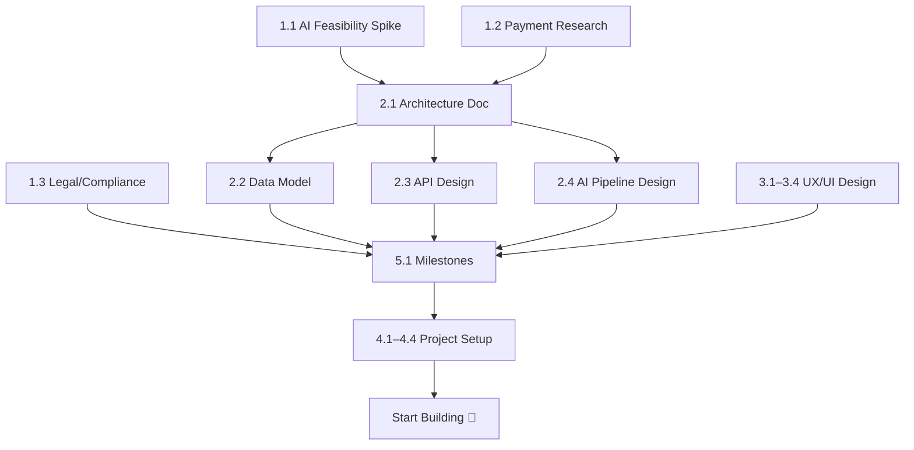

# Zghapari — Pre-Development Roadmap

> You have an excellent Product Description. Here's every step to complete **before writing production code**, in the order they should happen.

---

## Phase 1: Requirements & Research 🔍

You're largely done with this — the Product Description covers product requirements well. What's still needed:

### 1.1 AI/ML Feasibility Spike *(Critical — do this first)*
- **Character consistency:** Prototype the Photo-to-Character pipeline. Test IP-Adapter, InstantID, or PhotoMaker for generating a consistent illustrated child character across multiple images. This is the hardest technical risk — validate it before committing to architecture.
- **Georgian text quality:** Test 3–4 LLMs (GPT-4o, Claude, Gemini, Llama) specifically for Georgian story generation. Score them on grammar, vocabulary richness, and age-appropriateness. Document which model wins.
- **Art style control:** Prototype generating illustrations in your two target styles (Pirosmani-inspired vs. modern). Evaluate Stable Diffusion + LoRA, DALL·E, Midjourney API, or Flux.
- **Drawing analysis:** Test vision models on children's drawings — can they reliably identify objects/scenes?

> [!IMPORTANT]
> The character consistency spike alone can take 1–2 weeks. If this doesn't work reliably, it changes your entire product promise. **Do not skip this.**

### 1.2 Payment Provider Research
- Test BOG iPay and TBC Pay APIs — documentation quality, sandbox availability, fees.
- Determine if Stripe works for Georgian businesses (likely needs a US/EU entity).
- Choose one and document the integration requirements.

### 1.3 Legal & Compliance Checklist
- Draft a GDPR-compliant privacy policy (especially around children's photos).
- Research Georgian Personal Data Protection Law requirements.
- Decide on data residency (where will servers/data live?).
- Consult a lawyer if budget allows — children's data is high-risk.

---

## Phase 2: System Design 📐

### 2.1 Architecture Design Document
Based on your feasibility findings, write a technical architecture doc covering:

| Area | Decisions to Make |
|---|---|
| **Frontend** | React — confirmed. CSR vs SSR (Next.js)? State management? |
| **Backend** | Node.js — confirmed. Framework (Express, Fastify, NestJS)? |
| **Database** | PostgreSQL? MongoDB? What's the data model? |
| **AI Pipeline** | Which models? Self-hosted vs API? How do you queue jobs? |
| **File Storage** | S3/GCS for images & PDFs? CDN for serving? |
| **Auth** | JWT? Sessions? OAuth provider library? |
| **Job Queue** | BullMQ, Redis-based? For async image generation |
| **PDF Generation** | Puppeteer, WeasyPrint, or dedicated service? |
| **Deployment** | Cloud provider (AWS/GCP/Vercel)? Containerized? |
| **CI/CD** | GitHub Actions? What's the pipeline? |

### 2.2 Data Model Design
Create an ERD (Entity-Relationship Diagram) covering at minimum:
- `User`, `ChildProfile`, `CharacterReference`, `Book`, `Page`, `StoryTemplate`
- Relationships, indexes, and constraints
- How character references/embeddings are stored

### 2.3 API Design
- Define your REST (or GraphQL) API contract
- List every endpoint with request/response shapes
- Use OpenAPI/Swagger spec format — this becomes your frontend-backend contract

### 2.4 AI Pipeline Architecture
- Diagram the generation flow: prompt → text generation → image generation → assembly
- Define the job queue architecture (how do 11 parallel image generation calls work?)
- Design the character reference injection mechanism
- Plan the content moderation middleware layer

---

## Phase 3: UX/UI Design 🎨

### 3.1 User Flow Diagrams
- Map every flow from your Section 3 into wireframe-level diagrams
- Include error states, loading states, empty states

### 3.2 Wireframes
- Low-fidelity wireframes for every screen (Figma, Excalidraw, or similar)
- Key screens: onboarding, story creation wizard, editor, reader, bookshelf, child profile, payment

### 3.3 Design System
- Define colors, typography (Georgian fonts!), spacing, component library
- Mobile-first responsive breakpoints
- Design the two art style preview UIs

### 3.4 High-Fidelity Mockups
- At least the core flow (story creation → editor → reader) in full fidelity
- Both Georgian and English versions to verify layout with different scripts

> [!TIP]
> You can start Phase 3 in parallel with Phase 2 — designers and architects can work simultaneously.

---

## Phase 4: Project Setup & Infrastructure 🛠️

### 4.1 Repository Setup
- Initialize the monorepo properly (you have the skeleton already)
- Set up linting (ESLint, Prettier), commit hooks (Husky), and formatting rules
- Configure TypeScript (strongly recommended over plain JS for a project this size)
- Set up path aliases, environment variables structure

### 4.2 CI/CD Pipeline
- GitHub Actions for lint, test, build on every PR
- Staging and production deployment pipelines
- Environment management (dev, staging, prod)

### 4.3 Development Environment
- Docker Compose for local development (app + DB + Redis + mock services)
- Seed data scripts
- `.env.example` with all required environment variables documented

### 4.4 Cloud Infrastructure
- Provision cloud resources (database, storage, compute)
- Set up domain and SSL
- Configure logging and monitoring (Sentry, LogRocket, or similar)

---

## Phase 5: Development Planning 📋

### 5.1 Break MVP into Milestones
Suggested milestone breakdown:

| Milestone | What's Included | Est. Duration |
|---|---|---|
| **M1: Foundation** | Auth, user accounts, child profiles, DB, basic UI shell | 2–3 weeks |
| **M2: Story Engine** | Text generation, story creation wizard, basic editor | 2–3 weeks |
| **M3: Illustration Pipeline** | Image generation, character consistency, job queue | 3–4 weeks |
| **M4: Photo-to-Character** | Photo upload, character generation, profile storage | 2 weeks |
| **M5: Reader & Export** | On-device reader, PDF generation, library/bookshelf | 2 weeks |
| **M6: Payments** | Free tier tracking, payment integration, watermarking | 1–2 weeks |
| **M7: Polish & Launch** | Testing, content moderation, i18n, performance tuning | 2–3 weeks |

### 5.2 Create Granular Issues/Tickets
- Break each milestone into GitHub issues with acceptance criteria
- Label by area: `frontend`, `backend`, `ai-pipeline`, `infra`, `design`
- Assign to the two developers based on CLAUDE.md ownership

### 5.3 Define "Done" Criteria
- What does a deployable MVP look like?
- What's the minimum viable version of character consistency?
- What quality bar for Georgian text generation is acceptable?

---

## Recommended Order of Execution

---

## What You Should Do Right Now

1. **Start the AI feasibility spike** (Phase 1.1) — it's the highest-risk item and everything depends on it
2. **In parallel**, begin payment research (1.2) and legal review (1.3)
3. **In parallel**, start UX wireframes (3.1–3.2) — your Product Description is detailed enough to wireframe from

> [!CAUTION]
> The biggest risk to this project is **character consistency across illustrations**. If you can't solve this reliably, you'll need to rethink the core product promise. Spike it first, spike it fast.
